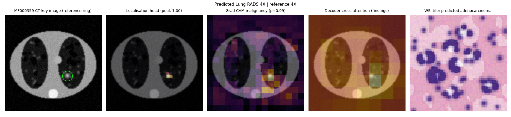
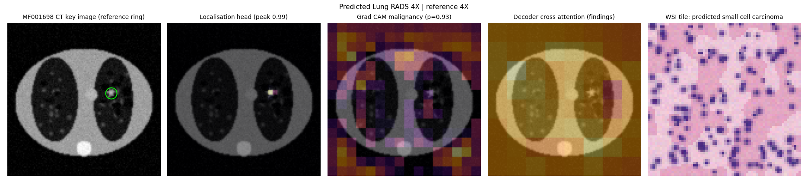
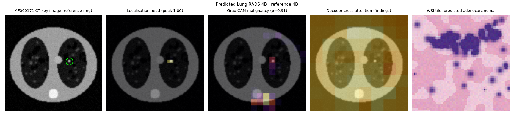
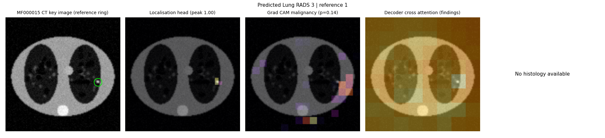
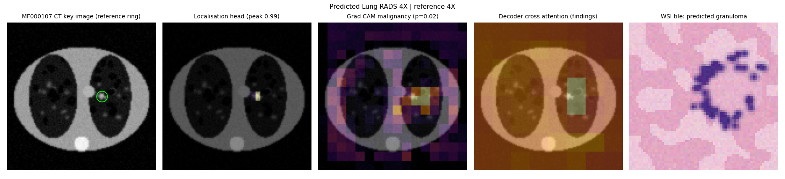
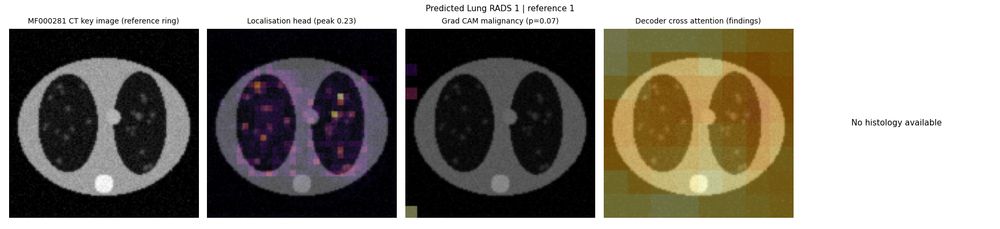

# Explainability summary

Synthetic cases only. Not for clinical use.

## MF000359

**Generated report.** FINDINGS: A solid nodule in the right upper lobe measures 10 mm with spiculated margins. One additional small nodule is noted, below 4 mm. No emphysema. No mediastinal or hilar lymphadenopathy. PATHOLOGY: CT guided core biopsy shows adenocarcinoma, acinar predominant, grade 2. Ki67 2%. PDL1 TPS 0%. Molecular testing: no driver detected. IMPRESSION: Lung RADS 4X. Highly suspicious nodule, concerning for primary lung malignancy. Histology confirms adenocarcinoma, clinical stage IA2 (T1b N0 M0). RECOMMENDATION: Refer to the lung cancer multidisciplinary team for staging review and treatment planning.

**Reference report.** FINDINGS: There is a 19 mm part solid nodule in the left lower lobe with a 9 mm solid component and spiculated margins. Severe centrilobular emphysema. No mediastinal or hilar lymphadenopathy. PATHOLOGY: CT guided core biopsy shows adenocarcinoma, acinar predominant, grade 2. Ki67 28%. PDL1 TPS 0%. Molecular testing: no driver detected. IMPRESSION: Lung RADS 4X. Highly suspicious nodule, concerning for primary lung malignancy. Histology confirms adenocarcinoma, clinical stage IA1 (T1a N0 M0). RECOMMENDATION: Refer to the lung cancer multidisciplinary team for staging review and treatment planning.

**Explanation target:** Adenocarcinoma

**Knowledge graph evidence chains**

* Strength 0.85: Spiculated margin suggests Primary lung malignancy [KB017]
* Strength 0.7: Lung RADS 4X suggests Primary lung malignancy [KB006]
* Strength 0.5: Upper lobe location increases risk of Primary lung malignancy [KB022]
* Strength 0.4: Family history of lung cancer increases risk of Primary lung malignancy [KB026]

**Retrieved guidance**

* Rank 1: KB012 Confirmed non small cell lung cancer
* Rank 2: KB017 Spiculated margins
* Rank 3: KB018 Part solid nodules

## MF001698

**Generated report.** FINDINGS: A solid nodule in the right upper lobe measures 10 mm with spiculated margins. One additional small nodule is noted, below 4 mm. No emphysema. No mediastinal or hilar lymphadenopathy. PATHOLOGY: CT guided core biopsy shows small cell carcinoma, high grade. Ki67 6%. IMPRESSION: Lung RADS 4X. Highly suspicious nodule, concerning for primary lung malignancy. Histology confirms small cell carcinoma, clinical stage IA2 (T1b N0 M0). RECOMMENDATION: Urgent oncology referral is advised; complete staging with PET CT and brain MRI.

**Reference report.** FINDINGS: There is a 9 mm solid nodule in the left upper lobe with spiculated margins. Moderate centrilobular emphysema. No mediastinal or hilar lymphadenopathy. PATHOLOGY: Surgical wedge resection shows small cell carcinoma, high grade. Ki67 82%. IMPRESSION: Lung RADS 4X. Highly suspicious nodule, concerning for primary lung malignancy. Histology confirms small cell carcinoma, clinical stage IV (T1a N0 M1). RECOMMENDATION: Urgent oncology referral is advised; complete staging with PET CT and brain MRI.

**Explanation target:** Small cell carcinoma

**Knowledge graph evidence chains**

* Strength 0.85: Spiculated margin suggests Primary lung malignancy [KB017]
* Strength 0.75: Heavy smoking exposure associated with Small cell carcinoma [KB029]
* Strength 0.75: Heavy smoking exposure associated with Small cell carcinoma [KB029] then Small cell carcinoma is a Primary lung malignancy [KB013]
* Strength 0.7: Lung RADS 4X suggests Primary lung malignancy [KB006]
* Strength 0.5: Upper lobe location increases risk of Primary lung malignancy [KB022]

**Retrieved guidance**

* Rank 1: KB013 Small cell lung cancer pathway
* Rank 2: KB012 Confirmed non small cell lung cancer
* Rank 3: KB017 Spiculated margins

## MF000171

**Generated report.** FINDINGS: A solid nodule in the right upper lobe measures 7 mm with smooth margins. Previously 7 mm, in keeping with interval growth; estimated volume doubling time 10 days. One additional small nodule is noted, below 4 mm. No emphysema. No mediastinal or hilar lymphadenopathy. PATHOLOGY: CT guided core biopsy shows adenocarcinoma, acinar predominant, grade 2. Ki67 2%. PDL1 TPS 0%. Molecular testing: no driver detected. IMPRESSION: Lung RADS 4B. Highly suspicious nodule, concerning for primary lung malignancy. Histology confirms adenocarcinoma, clinical stage IA1 (T1a N0 M0). RECOMMENDATION: Refer to the lung cancer multidisciplinary team for staging review and treatment planning.

**Reference report.** FINDINGS: A solid nodule in the left upper lobe measures 8 mm with smooth margins, abutting the pleura. Previously 7 mm, in keeping with interval growth; estimated volume doubling time 203 days. Two additional small nodules are noted, below 4 mm. Severe centrilobular emphysema. No mediastinal or hilar lymphadenopathy. PATHOLOGY: Surgical wedge resection shows adenocarcinoma, solid predominant, grade 3. Ki67 46%. PDL1 TPS 96%. Molecular testing: KRAS G12C. IMPRESSION: Lung RADS 4B. Highly suspicious nodule, concerning for primary lung malignancy. Histology confirms adenocarcinoma, clinical stage IA1 (T1a N0 M0). RECOMMENDATION: Refer to the lung cancer multidisciplinary team for staging review and treatment planning.

**Explanation target:** Adenocarcinoma

**Knowledge graph evidence chains**

* Strength 0.85: Volume doubling time below 400 days suggests Primary lung malignancy [KB020]
* Strength 0.75: Part solid nodule suggests Adenocarcinoma [KB018]
* Strength 0.75: Part solid nodule suggests Adenocarcinoma [KB018] then Adenocarcinoma is a Primary lung malignancy [KB012]
* Strength 0.75: Heavy smoking exposure associated with Small cell carcinoma [KB029] then Small cell carcinoma is a Primary lung malignancy [KB013]
* Strength 0.6: Lung RADS 4B suggests Primary lung malignancy [KB005]
* Strength 0.5: Upper lobe location increases risk of Primary lung malignancy [KB022]

**Retrieved guidance**

* Rank 1: KB012 Confirmed non small cell lung cancer
* Rank 2: KB018 Part solid nodules
* Rank 3: KB027 Invasive adenocarcinoma grading

## MF000015

**Generated report.** FINDINGS: There is a 7 mm solid nodule in the right upper lobe with smooth margins. One additional small nodule is noted, below 4 mm. No emphysema. No mediastinal or hilar lymphadenopathy. PATHOLOGY: No histology available. IMPRESSION: Lung RADS 3. Probably benign nodule. RECOMMENDATION: Arrange low dose CT in 6 months to assess stability.

**Reference report.** FINDINGS: A calcified nodule in the left lower lobe measures 7 mm with central calcification. Severe centrilobular emphysema. No mediastinal or hilar lymphadenopathy. PATHOLOGY: No histology available. IMPRESSION: Lung RADS 1. Benign calcified nodule. RECOMMENDATION: Continue annual low dose CT screening in 12 months.

**Explanation target:** Benign process

**Knowledge graph evidence chains**

* Strength 0.7: Lung RADS 3 suggests Benign process [KB003]

**Retrieved guidance**

* Rank 1: KB003 Lung RADS category 3 probably benign
* Rank 2: KB002 Lung RADS category 2 benign behaviour
* Rank 3: KB001 Lung RADS category 1 negative or benign appearance

## MF000107

**Generated report.** FINDINGS: A solid nodule in the right upper lobe measures 10 mm with spiculated margins. One additional small nodule is noted, below 4 mm. No emphysema. No mediastinal or hilar lymphadenopathy. PATHOLOGY: CT guided core biopsy shows granulomatous inflammation with no evidence of malignancy. IMPRESSION: Lung RADS 4X. Highly suspicious nodule, concerning for primary lung malignancy. Histology confirms benign granuloma. RECOMMENDATION: Benign histology is concordant with imaging; confirm stability with CT in 6 months.

**Reference report.** FINDINGS: A solid nodule in the left lower lobe measures 9 mm with spiculated margins. One additional small nodule is noted, below 4 mm. Severe centrilobular emphysema. No mediastinal or hilar lymphadenopathy. PATHOLOGY: Surgical wedge resection shows granulomatous inflammation with no evidence of malignancy. IMPRESSION: Lung RADS 4X. Highly suspicious nodule, concerning for primary lung malignancy. Histology confirms benign granuloma. RECOMMENDATION: Benign histology is concordant with imaging; confirm stability with CT in 6 months.

**Explanation target:** Granuloma

**Knowledge graph evidence chains**

* No supporting chain within three hops.

**Retrieved guidance**

* Rank 1: KB014 Benign concordant histology
* Rank 2: KB008 Benign calcification patterns
* Rank 3: KB017 Spiculated margins

## MF000281

**Generated report.** FINDINGS: No suspicious pulmonary nodule is seen. Mild centrilobular emphysema. No mediastinal or hilar lymphadenopathy. PATHOLOGY: No histology available. IMPRESSION: Lung RADS 1. No suspicious pulmonary nodule. RECOMMENDATION: Continue annual low dose CT screening in 12 months.

**Reference report.** FINDINGS: No pulmonary nodule or mass is identified. No emphysema. No mediastinal or hilar lymphadenopathy. PATHOLOGY: No histology available. IMPRESSION: Lung RADS 1. No suspicious pulmonary nodule. RECOMMENDATION: Continue annual low dose CT screening in 12 months.

**Explanation target:** Benign process

**Knowledge graph evidence chains**

* Strength 0.9: Lung RADS 1 suggests Benign process [KB001]

**Retrieved guidance**

* Rank 1: KB001 Lung RADS category 1 negative or benign appearance
* Rank 2: KB002 Lung RADS category 2 benign behaviour
* Rank 3: KB041 Low dose CT protocol
